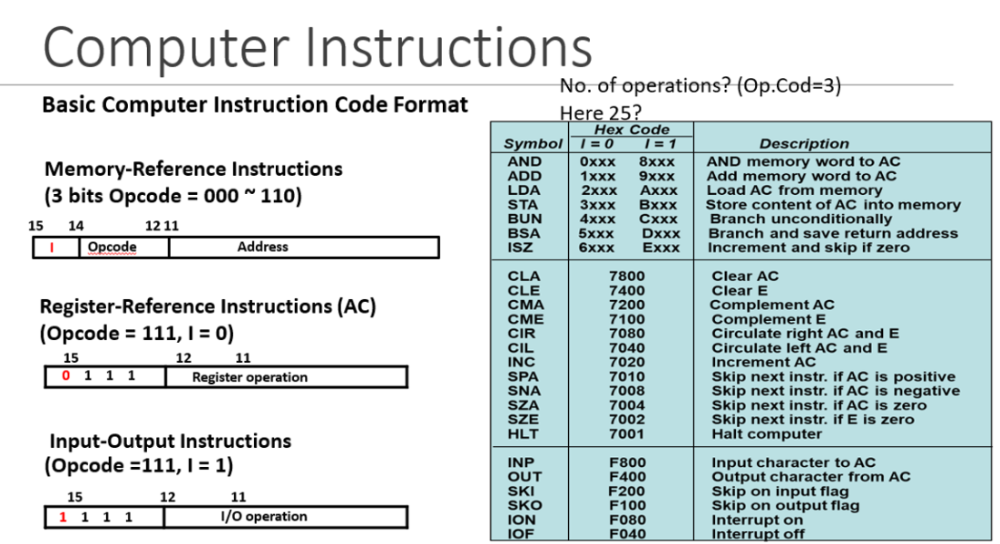
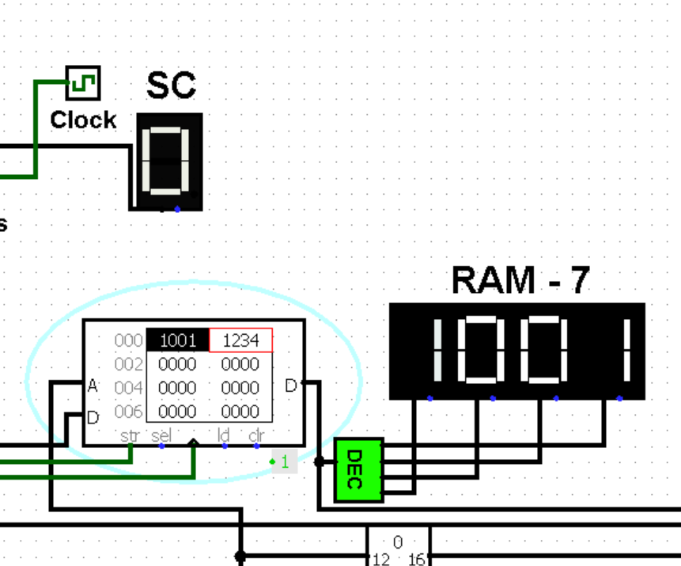
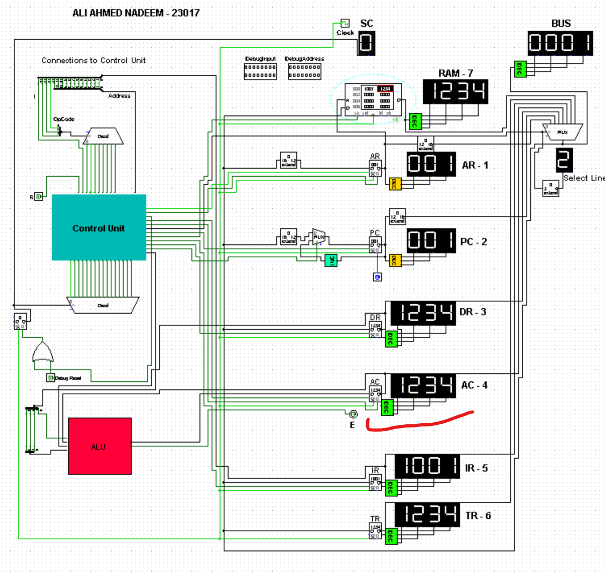

# MARIE 16-bit CPU Architecture Implementation in Logism

The circuit file includes the implementation for the [16-bit MARIE CPU Architecture](https://marie.js.org/book.pdf) or see the image below. The circuit file is made on [Logism](https://sourceforge.net/projects/circuit/), which is a free and open source software for building circuits.

The implementation is done from the very ground up using basic logic gates, registers, and RAM. The circuit file contains two circuits, one contains the implementation of the circuit 
while the main contains the CPU where you can adjust registers and run instructions accordingly.

The complete instruction set is not yet supported and hence some instructions are likely to not work correctly. However, the basic instructions work showcasing the flow. All registers are labelled.

## Sample Instructions

Not all are implemented but the gist is given below.



## Example Instruction Simulation (LDA)

For example, the LD instruction works in the following manner. The ```opcode``` is 0x1 and the remaining 12 bits identify the memory address from where to load data into AC.

To simulate this, enter the required data in RAM for example as shown below. The ```0x000``` memory address contains the opcode 1, and memory address 001 where the data should be found ```1001```. Then, on address ```001``` data is saved, which will be loaded in the AC. Refer to pictures below.

### Load contents in ram:

Simulation can be done from the toolbar in Logism by enabling ticks (Ctrl + K)



### After simulating the instruction:




